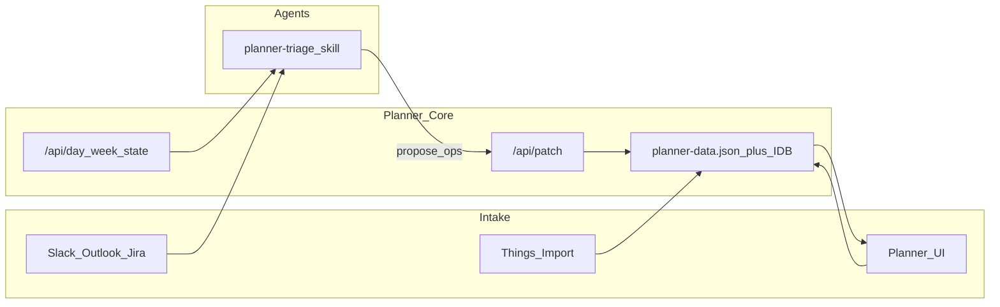

# Planner App — полный план перехода с Things 3

**Как пользоваться:** в чате этого проекта сказать агенту:

```text
Read PLANNER-IMPROVEMENT-BRIEF.md and PLANNER-THINGS-CUTOVER.md.
Implement Phase N only. Preserve goals/notes/journal. Migrate schema with defaults.
Do not build mobile, Jira sync, or live calendar unless this phase says so.
```

Канонический product brief: [`PLANNER-IMPROVEMENT-BRIEF.md`](./PLANNER-IMPROVEMENT-BRIEF.md). Этот файл — **исполняемый roadmap** поверх брифа + фактический gap в коде.

**Цель:** Planner = source of truth для личных work-задач; Things отключается после dual-run. Workflow агента: **propose → human confirm → apply** (как сейчас с Things).

**Не делать в MVP:** multi-user, полный Jira two-way sync, native mobile, gamification, live Calendar import (это Phase 8 / later).

---

## 0. Контекст: что нельзя потерять из Things

Операционная модель (уже отработана в работе):

- **Today** = максимум **3–5** Do/Promise (тяжёлые meeting-дни, особенно Wed → ближе к 3). Wait-checks отдельно, не едят Do-минуты.
- **Backlog (Anytime)** = всё остальное, строго **P-sorted** (`P1` → `P2.1` → … → `P4`). Без «надежды» на Today.
- **Kinds:** `do` | `wait` | `promise` | `park` (first-class, не свободные tags).
- **Wait transition:** при переходе в wait → kind=`wait` + **priority=`p3`** + `waitingOn` + `nextCheckAt` (waiting ≠ urgent для владельца).
- **Evening clear:** unfinished ≠ автоматически завтра; reschedule на weekday / backlog. **Никогда Sat/Sun** для work.
- **Intake:** Slack promises + Outlook (Jira/mail) часто важнее soft Jira priority; Planner не обязан сам читать Slack — агент пишет задачи через API.
- **Justin / hard Promise** → высокий приоритет (`p1`), даже если Jira soft.
- Capacity: ~8h день, lunch 13:00–13:30 («Launch»), comms 60–90 min, deep Do предпочтительно **до 13:00**.

---

## 1. Текущее состояние кода (baseline)

| Файл | Роль |
|------|------|
| [`planner.html`](./planner.html) | Весь UI + логика (~5.3k lines) |
| [`js/planner-db.js`](./js/planner-db.js) | Dexie IndexedDB load/save + BroadcastChannel |
| [`server.mjs`](./server.mjs) | Static + только `POST /api/save` |
| [`planner-data.json`](./planner-data.json) | Seed / ручной export; **не live sync** |

Уже есть: tasks/notes/goals/journal/tags, P1–P4, milestones, comments/links, drag reorder, search, theme, export/import JSON.

**Критический gap:** `persistData()` пишет только в IndexedDB; клиент **не вызывает** `/api/save`. Нет `kind` / дат / Today / capacity / agent patch API. Acceptance checkboxes в брифе все unchecked.

Запуск: `npm start` → `http://127.0.0.1:3847/`.

Ключевые точки в коде:

- `normalizeTask` / `ensureDataShape` / `persistData` — в `planner.html`
- `validatePayload` — в `server.mjs` (сейчас без `tags` / `settings`)

---

## 2. Целевая архитектура



**Source of truth после cutover:** `planner-data.json` на диске (агенты читают/патчат файл или HTTP), IndexedDB = кэш UI с sync через server.

---

## 3. Целевая схема данных

Добавить `schemaVersion` (стартовать с `2`) в корне state.

### Task (расширить `normalizeTask` в `planner.html`)

| Поле | Тип | Правила |
|------|-----|---------|
| `kind` | `do` \| `wait` \| `promise` \| `park` | default `do` при миграции |
| `scheduledOn` | `YYYY-MM-DD` \| null | «when» / Today |
| `deadline` | `YYYY-MM-DD` \| null | hard due / promise |
| `waitingOn` | string \| null | required если kind=wait |
| `promisedTo` | string \| null | recommended для promise |
| `nextCheckAt` | `YYYY-MM-DD` \| null | Wait next-check |
| `timeEstimateMin` | number \| null | defaults S=15 M=45 L=90 |
| `completedAt` | ISO \| null | при done=true |
| `rolloverCount` | number | +1 при evening reschedule без прогресса |
| `project` | string \| null | лёгкий bucket: `TDW Backlog`, `Wait Look`, stream names — **не** дерево как в Things |
| `jiraKey` | string \| null | optional parse из title/desc |

Priority остаётся `p1`…`p4`. Title **не обязан** содержать `P1 Do —` (в UI показывать badge kind+P); при Things-import парсить префиксы из имени.

### Settings (новый объект `data.settings`)

- `workDayMinutes` (480), `commsBlockMinutes` (90), `workDayStart` (`10:00`/`11:00`)
- `maxDoItems` (5), `maxWaitChecks` (5), `lunchMinutes` (30)
- `weekTemplate` — recurring blocks (см. бриф § Recurring week template)
- `noWeekends: true`
- `wedOneOnOneRotation` — Dima/Mimi biweekly anchor date

### Day capacity (computed, не обязательно persist)

```
availableDoMinutes = workDayMinutes − meetings − lunch − comms
plannedDoMinutes = sum(timeEstimateMin of do+promise where scheduledOn=day)
overload = plannedDoMinutes > available OR count(do+promise) > maxDoItems
```

Wait не входит в Do budget; отдельный `checkBudget`.

---

## 4. Фазы реализации (slices для агента)

Каждый slice = один PR/сессия. Не смешивать UI polish с API в одном огромном diff без нужды; но **Phase 1+2 обязательны до cutover**.

### Phase 1 — Data model + migration + file sync

**Files:** `planner.html` (`normalizeTask`, `ensureDataShape`, `persistData`), `js/planner-db.js`, `server.mjs`, `planner-data.json`.

1. Добавить поля схемы + defaults в `normalizeTask` / goals untouched.
2. Migration on load: missing `kind` → `do`; strip/parse Things-like title prefixes into priority/kind if present (`P3 Wait — …`).
3. `schemaVersion: 2`.
4. **Fix sync:** after IDB save, `POST /api/save` full state (include `tags` + `settings` — расширить `validatePayload` в `server.mjs`).
5. On boot: if server reachable, prefer `GET /planner-data.json` (or new `GET /api/state`) over stale IDB when file `updatedAt` newer — simple last-write strategy: UI save → file; agent patch → file → UI polls/reloads via BroadcastChannel or `visibilitychange` fetch.
6. Preserve existing notes/goals/journal/tags.

**Done when:** reload browser → fields persist; `planner-data.json` updates after UI edit.

### Phase 2 — Today / Day plan UI (primary surface)

**Files:** `planner.html` (nav + new panel).

1. Sidebar: **Today** (default) above Tasks. Tasks = «All / Backlog» (open undated + park + not today).
2. Today view for selected date (default today, local TZ):
   - Capacity header (even if Phase 3 stub: manual meeting minutes)
   - Sections: **Do** · **Promise** · **Wait** · overflow/not today link
3. Filters: P, person (`waitingOn`/`promisedTo`), jiraKey.
4. Actions per row: complete; set kind; schedule to date; move to backlog (`scheduledOn=null`, kind park or keep); Wait demote rule (auto `p3`).
5. Soft visual: Wait quieter; Promise shows who + deadline.
6. Composer presets: Quick Do / Promise (who+when) / Waiting on… (person+nextCheck).
7. Hard rule in schedule helpers: reject Sat/Sun (snap to next Monday) when `noWeekends`.

**Done when:** acceptance из брифа: «I can open Today and see Do / Promise / Wait separately» + Wait не в Do count.

### Phase 3 — Capacity engine (week template)

**Files:** new `js/capacity.js` (prefer extract) + Settings UI in `planner.html`.

1. Encode week template from brief (standup, BA Canadianization, design sync, mobile Wed, 1:1s, lunch, text sync ≈10 min, skip Wed BA Sync).
2. Wed 17:00 alternates Dima/Mimi; Fri «1-on-1 with Alexey» alias = Kolya.
3. Manual day override: extra meeting block.
4. Capacity meter on Today; red overload; block or warn when adding Do beyond cap (warn+allow with confirm is OK).
5. Default estimate if missing: M=45 for do/promise.

**Done when:** Wed shows low available Do; Wait checks don't inflate meter.

### Phase 4 — Agent API (required for leaving Things)

**Files:** `server.mjs` (+ thin `js/day-query.js` shared if needed).

| Endpoint | Behavior |
|----------|----------|
| `GET /api/state` | Full normalized JSON |
| `GET /api/day?date=YYYY-MM-DD` | capacity + sections `{do,promise,wait,other}` + overload flags |
| `GET /api/week?start=YYYY-MM-DD` | 7 days summary |
| `POST /api/patch` | body `{ ops: [...] }` apply typed ops, save file+notify |
| `POST /api/patch?dryRun=1` | preview day/week after ops, no save |

**Ops (minimum):** `createTask`, `complete`, `setKind`, `setPriority`, `schedule`, `setEstimate`, `setProject`, `prependNote` (notes chronology: newest first in `description` or `comments`), `reorder`, `delete`.

Idempotent where possible (ops with client `opId`). Schema version check. Never auto-confirm from UI without user — agents use dryRun then patch after human OK.

**Done when:** `curl` can read today and schedule a task; UI reflects within refresh.

### Phase 5 — Morning / Evening triage surfaces

**UI (rule-based, no LLM inside app):**

1. **Evening clear** mode: list incomplete Today → actions Reschedule (date picker weekdays) / Backlog / Complete; increment `rolloverCount`; flag zombies if `rolloverCount >= 3`.
2. **Morning** mode: leftovers + scheduled today + unscheduled P1–P2 candidates; propose fill to `maxDoItems` / minutes; user confirms batch.

**Done when:** evening clear cannot silently leave 15 items on Today.

### Phase 6 — Things import + dual-run tools

1. Import script or Settings «Import Things JSON/TSV»: map tags `Do/Wait/Promise/Park` → kind; `P1`–`P4` → priority; parse title prefixes; notes → description; activation → `scheduledOn`; deadline → `deadline`.
2. Export from Things: AppleScript dump (Inbox/Today/Anytime) → TSV/JSON; document columns in this repo under `scripts/` when added.
3. Dual-run rule: new captures prefer Planner; weekly reconcile until Things empty of work items.

### Phase 7 — Cutover agent skill (Work notes vault — отдельный чат)

Не в коде этого репо, но **обязательный шаг перехода** (vault: `!!! My Notes/!!! Work`):

1. Новый skill `planner-triage` (или переписать `things-triage`): Step 1 = `GET /api/day` вместо AppleScript; apply = `POST /api/patch` after confirm.
2. Сохранить Outlook + Slack intake steps; заменить только persistence/apply target.
3. Rules files (`things-wait-priority`, `things-no-weekends`, chronology notes) → указать Planner fields.
4. Когда 1–2 недели только Planner — archive Things scripts as read-only.

### Phase 8 — Polish (after daily use)

- Calendar/.ics import
- Zombie review UI
- Estimate presets S/M/L chips
- Projects filter chips (`TDW Backlog`, `Wait Look`, CAD streams)
- Optional: parse Jira key → linkify
- Reminders: out of scope unless macOS notification later

---

## 5. UX / product constraints for implementers

- Language: English UI labels OK; field names English.
- Today must not be an undifferentiated dump.
- Keep Goals / Journal / Notes working after every migration.
- Prefer extracting modules (`js/capacity.js`, `js/api-ops.js`) when `planner.html` grows further — don't rewrite entire app to React in this transition.
- Visual: capacity meter clear; avoid dashboard clutter on Today first screen (brand Plan·ME can stay).

---

## 6. Порядок работ (чеклист сессий)

1. Phase 1 (schema + sync)
2. Phase 2 (Today UI)
3. Phase 3 (capacity template)
4. Phase 4 (agent API)
5. Phase 5 (morning/evening)
6. Phase 6 (Things import) → dual-run
7. Phase 7 в vault-чате (skill cutover)
8. Phase 8 polish → drop Things

---

## 7. Acceptance — можно выключать Things

- [ ] Today показывает Do / Promise / Wait раздельно; cap 3–5 виден
- [ ] Wait не в Do-минутах; transition Wait → p3
- [ ] Schedule не ставит Sat/Sun
- [ ] Evening clear принудительно разгребает leftovers
- [ ] `GET /api/day` + `POST /api/patch` работают; `planner-data.json` актуален
- [ ] Агент triage читает/патчит Planner без AppleScript
- [ ] Импорт Things выполнен; work-задачи не живут только в Things
- [ ] Goals/milestones/journal не сломаны

---

## 8. Риски и решения

| Риск | Митигация |
|------|-----------|
| IDB vs file drift | Phase 1 sync обязателен до API |
| Монолит `planner.html` | Extract только capacity/ops; не big-bang rewrite |
| Потеря Things capture habit | Dual-run + import; presets Promise/Wait в composer |
| Агент ломает данные | dryRun + confirm; schemaVersion; backup export before import |
| Перегруз scope | Не начинать Phase 8 до daily use Phase 2–4 |

---

## 9. Progress tracker

| Phase | Status |
|-------|--------|
| 1 Schema + file sync | **done** |
| 2 Today UI | **done** |
| 3 Capacity | **done** |
| 4 Agent API | **done** |
| 5 Morning/Evening | **done** |
| 6 Things import | **done** (dump+merge 2026-10-05) |
| 7 Skill cutover (vault) | **done** (2026-10-05) |
| 8 Polish + drop Things | deferred |
